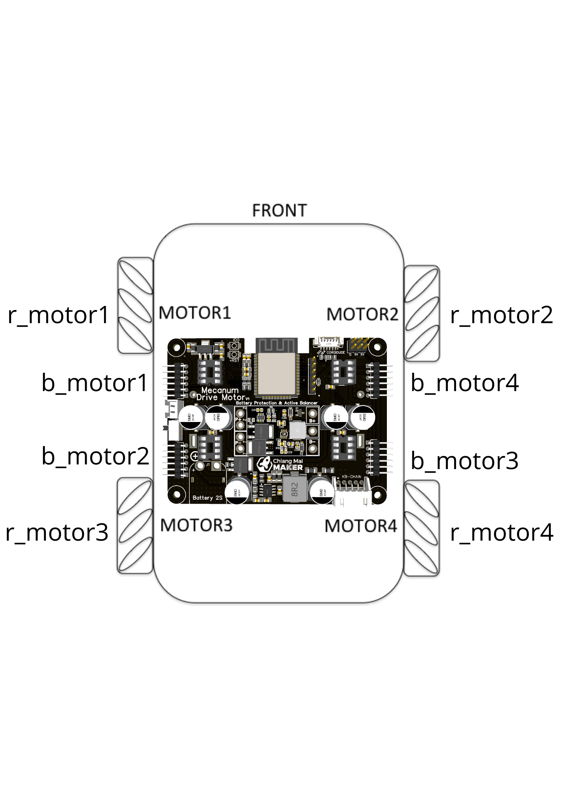

# Mecanum_motor

# ถ้าเป็น jetson nano ต้องลง I2C ให้เรียบร้อยด้วย
# sudo pip3 install Jetson.GPIO
# sudo pip3 install Adafruit-Blinka==4.5.0
# sudo pip3 install adafruit-circuitpython-busdevice==5.1.0
# sudo pip3 install Adafruit-PlatformDetect==2.6.0
